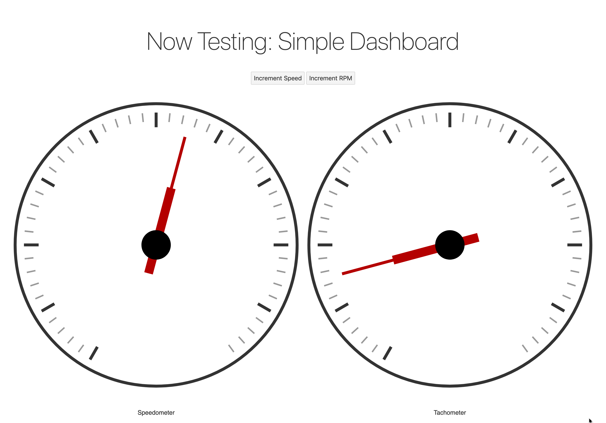

# CSE 155 Design Project: Client
This repository contains a simple driver simulation environment built to test different vehicle instrument panel 
layouts. The client contains the code for the simulation itself, the data collection apparatus, and the GUI that the 
user interacts with.



## Building and Running
***Note:** This project uses the Svelte framework for user interfaces and therefore requires a NodeJS environment to be 
installed locally. We are currently targeting NodeJS version 14.13.1 or later.*

### Build
Clone repository:
```
# For HTTPS-based clone:
git clone https://github.com/Vehicle-Information-Display/client.git

# For SSH-based clone:
git clone git@github.com:Vehicle-Information-Display/client.git

# Move into directory
cd client
``` 

Install dependencies:
```
npm install
```

Build project:
```
npm run-script build
```

### Run with Dev Mode
This mode will live-update when changes are made to the source.
```
npm run dev
```

### Run in "Production" Mode
This mode will *not* live update when changes are made to the source. You must also run the build step when you make 
changes. This mode, however, is more reliable and generally doesn't require as much work to get running.
```
npm start
```